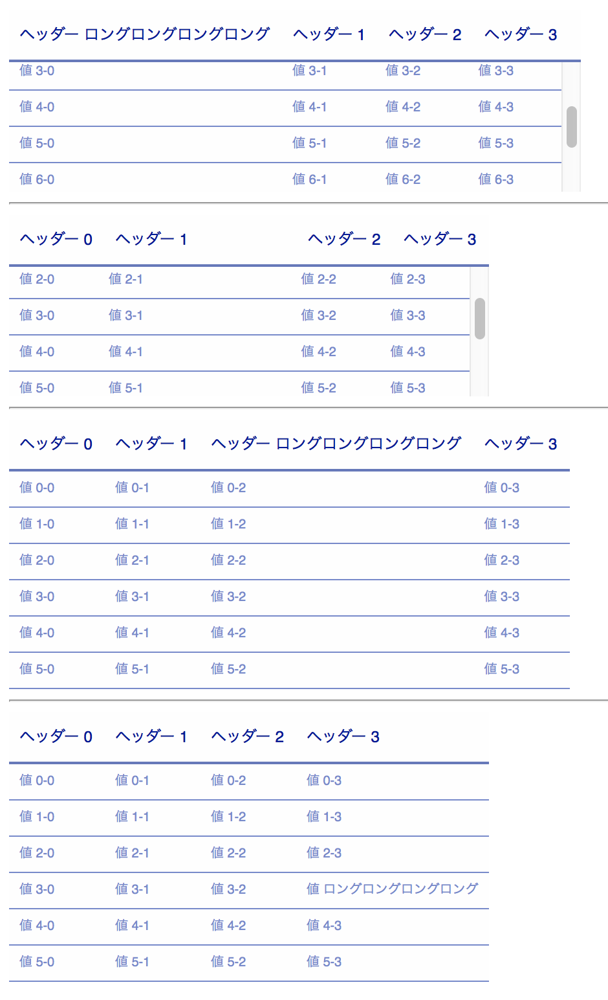

## Table With Fixed Header

### How to use
```
	…
	<script src="/path/to/jquery.js"></script>
	<script src="tableWithFixedHeader.js"></script>
	<link rel="stylesheet" href="tableWithFixedHeader.css" />
	<script>
		$(document).ready(function() {
			$('table.tableWithFixedHeader tbody').css('height', 200);
			$('table.tableWithFixedHeader').tableWithFixedHeader();
		});
	</script>
	…
	<table class="tableWithFixedHeader">
	…
	</talbe>
```

### Examples


### 利用条件
* いかなる種類の使用, 改造, 転載を行っても構いません.
* 改変, 部分的な利用したものはあなたのものになります. 公開するときはあなたの名前の元に公開してください.
* これによるいかなる損害も作者は責任を負わないものとします.
